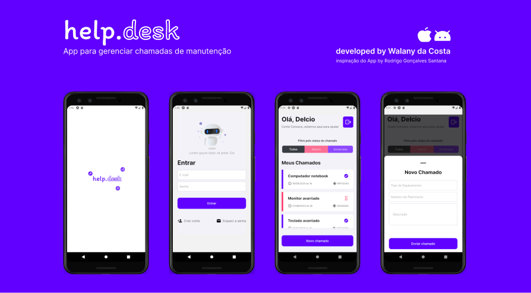

## Descrição do Projeto

---

> Este projeto tem como objetivo ajudar os tecnicos de manutenção de uma instituição a atender
> os pedido de reparo ou remoção de dispositivos com problemas que surgem nos departamentos, permitindo
> os usuarios que no caso são outros profissionais que não estão ligados com TI reportarem o problema nos
> dispositivos ou algo relacionado com esses dispositivos da instituição como: impressoras, computadores, problema de falta de rede, afim dos tecnicos de manutenção podem solucionar. Esse projeto foi desenvolvido
> pensando nos usuarios comuns por isso que tem uma interface de facil uso e simples mas não no sentido de ser pobre.

### sobre this projeto

> Esse projeto surgiu devido a uma metodologia de estudo que estou tentando empregar que é aprender por meio de projeto, então escolhe esse projeto visto que é um projeto já desenvolvido pela rockeseat mas promete que não iria fazer o projeto seguindo os mesmos passos da rocketseat, então decide não clonar
> o projeto, mas sim tirar um print da imagem da aplicação e fazer do total zero sem seguir nada do video
> usando: arquitetura limpa, testes, ci/cd, github, gitflow como modo de trabalho, solid tudo que já venho estudando em react js para web levando para react native.

<p align='center'>🚧O HelpDesktop-Clone 🚀 Em construção... 🚧</p>

## Indices

---

- [Descrisão do Projecto](#descrisão-do-projecto)
- [Features](#features)
- [Começando a usar](#começando-a-usar)
- [Tecnologia usada](#tecnologia-usada)
- [Autores](#autores)
- [Licença](#licença)
- [Expressões de gratidão](#expressões-de-gratidão)

## Features

---

> Aqui temos as funcionalidades desenvolvidas nesse projeto:

- [x] login
- [x] signUp
- [x] home

## Começando a usar

---

> Para que esse projeto possa funcionar na sua máquina deve-se cumprir os seguintes requisitos
> e depois seguir passo a passo como instalar o projeto.

### Pré-requisitos

> Para se ter esse projeto a funcionar deve se ter o [Nodejs](https://nodejs.org/pt-br/download) na sua maquina que vai permitir com que projeto rode na sua maquina, [Git](https://git-scm.com/downloads), conseguir clonar o projeto na sua máquina, [Vscode](https://code.visualstudio.com/download) fazer algumas alterações do projeto, [expo-go](https://docs.expo.dev/get-started/expo-go/) para poder ver o projeto a funcionar deve ser baixado para smartphone ou emulador android ou iOS e [Nox](https://www.bignox.com/) para emular android caso estejas no windows.

### instalação do projecto

```bash
 # Primeiro clonar o projecto
    git clone <URL>

 # Acender a pasta
    cd helpdeskclone

 # instalar as dependencias do projecto
    npm install

 # Rodar aplicativo
    npm start

 # Depois scanner o QRcode ou uri para ver o projecto a funcionar
```

## Tecnologia usada

---

> Durante a criação desse projecto foram usada bibliotecas e framework que possibilitaram e facilitaram
> o desenvolvimento do HELPDesktop, sendo assim temos a lista:

- [expo](https://docs.expo.dev/)
- [react-native](#)
- [typescript](#)
- [eslint](#)
- [typescript](#)
- [zod](#)
- [styled-components](#)
- [@gorhom/bottom-sheet](#)
- [react-native-reanimated](#)
- [react](#)
- [lottie-react-native](#)
- [firebase](#)
- [expo-font](#)
- [react-native-gesture-handler](#)
- [react-native-safe-area-context](#)
- [react-native-screens](#)
- [expo-splash-screen](#)
- [expo-status-bar](#)

## Autores

---

> Autor da ideia
> Projeto desenvolvido por Walany da Costa.

## Licença

---

> Este projecto está sob a licença MIT (link da licença).

## Expressões de gratidão

---

> Convidou Todas a gente que gostou desse projecto tanto nos aspeto de tecnologia ou a ideias do projecto para contribuir esse
> projecto afim de dar passo maior.
